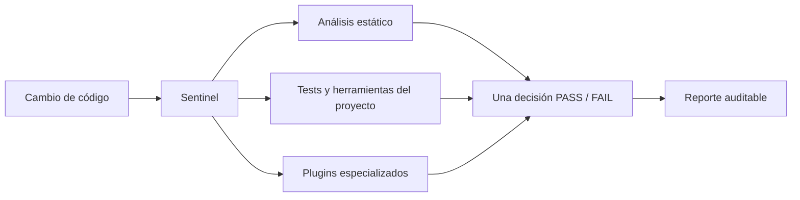

# Glory Sentinel


**Una sola forma de saber si un cambio está realmente listo.**

Glory Sentinel es una plataforma local de calidad para equipos que trabajan con desarrolladores, agentes de código o ambos. Analiza el código, reúne los checks del proyecto y produce una decisión de cierre reproducible: qué pasó, qué falló y qué debe corregirse antes de integrar.

No reemplaza tus tests, tu linter ni tu type-checker. Los convierte en partes de un mismo contrato para evitar que cada proyecto —o cada agente— termine inventando su propio gate, sus propios scripts y una definición diferente de “terminado”.

Sentinel es estático y determinista. Funciona localmente, no requiere IA, conexión a Internet, claves ni un servicio externo para analizar tu código.

## El problema que resuelve

En un proyecto real, la calidad suele estar repartida entre ESLint, tests, compiladores, scripts del repositorio, convenciones escritas y revisiones manuales. Cuando participan varios agentes, esa dispersión se vuelve más peligrosa: un check puede omitirse, duplicarse o producir un resultado que nadie conserva.

Sentinel concentra ese recorrido:



El resultado no es solo un exit code. Sentinel diferencia hallazgos del código, tests fallidos, timeouts, cancelaciones, errores de herramienta y cobertura que no llegó a ejecutarse. Un error operativo nunca se disfraza de PASS.

## Qué aporta

- **Problemas antes de producción.** Detecta patrones inseguros, errores de arquitectura y deuda técnica mientras todavía son baratos de corregir.
- **Una decisión coherente.** El mismo contrato decide si el cambio puede cerrarse, sin gates paralelos.
- **Evidencia útil.** Genera reportes Markdown y JSON que pueden leer personas, CI y agentes.
- **Reglas consistentes.** CLI, LSP y extensión de VS Code consumen el mismo motor de análisis.
- **Integración con tu stack.** Puede orquestar tests, linters, compiladores y analizadores externos como etapas declaradas, sin reimplementarlos.
- **Trabajo paralelo más seguro.** Su coordinación opcional aísla tareas en worktrees y conserva ownership, estado, integración y cleanup.

## Qué analiza

El catálogo actual incluye más de 100 reglas para PHP/WordPress, TypeScript/React, JavaScript, CSS y Rust.
Entre otras cosas, Sentinel puede detectar:

- secretos hardcodeados, `eval`, procesos shell inseguros y SQL sin preparación;
- catches vacíos, errores enmascarados y recursos sin cleanup;
- componentes demasiado grandes, responsabilidades mezcladas y límites de arquitectura rotos;
- efectos React sin limpieza, mutaciones de estado y patrones frágiles de Zustand;
- contratos incompatibles entre APIs PHP y consumidores TypeScript;
- `unwrap`, `panic`, handlers acoplados a base de datos y otros riesgos habituales en Rust;
- convenciones específicas de un producto mediante reglas o adapters declarados y con ownership explícito.

Las reglas pueden activarse, desactivarse o cambiar de severidad por proyecto. El objetivo no es imponer un estilo universal, sino convertir las decisiones de calidad del equipo en controles repetibles.

Consulta el [catálogo completo de reglas](rules.md).

## Dos formas de usar Sentinel

### 1. Analizador estático

Es la entrada más sencilla. Puedes analizar un archivo o un repositorio y obtener resultados en Markdown o JSON:

```bash
sentinel analyze --workspace . --format markdown
sentinel analyze --file src/app.ts --format json
```

Este modo es útil en cualquier carpeta y no necesita coordinación de tareas ni un gate completo.

### 2. Quality gate

Cuando el proyecto necesita una decisión de cierre, `sentinel check` ejecuta las etapas declaradas y crea el reporte combinado:

```bash
sentinel check FEATURE-123 --stages sentinel-stages.json
```

El manifest indica qué herramientas forman parte del gate. Por ejemplo, este manifest ejecuta el propio analizador de Sentinel como una etapa estructurada:

```json
{
    "schemaVersion": 1,
    "stages": [
        {
            "name": "sentinel",
            "executable": "sentinel",
            "args": ["analyze", "--workspace", ".", "--format", "json", "--output", "{reportPath}"],
            "expectedSchemaVersion": "1",
            "timeoutMs": 60000
        }
    ]
}
```

Después puedes añadir ESLint, tests, compilación, VarSense u otra herramienta que emita el contrato estructurado. Sentinel conserva una sola decisión final y un solo lugar para consultar la evidencia.

## Sentinel, gate y wrappers: la diferencia

- **Sentinel** es el producto: motor de reglas, CLI, reportes, orquestación y coordinación opcional.
- **El gate** es la operación `sentinel check <task-id>` que produce la decisión final.
- **`gate:check`** puede ser un alias npm fino para preparar el manifest del stack y delegar en Sentinel.
- **Un analyzer o plugin** aporta hallazgos; no crea una segunda decisión de cierre.

En otras palabras: Sentinel contiene el gate. No son dos productos separados.

Los consumidores antiguos pueden conservar temporalmente `task:check` o `scripts/quality`, pero no deben añadirles lógica nueva. Sentinel incluye un inventario de migración para retirar esas copias sin perder cobertura.

## Instalación desde un release

Mientras no exista un paquete publicado para tu registry, instala desde el checkout de un release verificado:

```bash
git clone https://github.com/1ndoryu/glory-sentinel.git
cd glory-sentinel
git checkout v0.7.1
npm ci
npm run compile
node out/cli/index.js install --source-root . --with-shims --with-path
```

Abre una terminal nueva y verifica la instalación real:

```bash
sentinel --version
sentinel --help
sentinel doctor --json
```

La versión visible no basta para garantizar capacidades. Los proyectos que dependen de Sentinel deben fijar también el commit, el protocolo y el hash del artefacto en su lock.

## Añadir Sentinel a un proyecto nuevo

El bootstrap genera una política mínima para Node, Rust, Python o repositorios mixtos:

```bash
sentinel init --preset node \
  --project-root . \
  --primary-branch <rama-real> \
  --with-alias gate:check
```

Antes de escribir archivos puedes inspeccionar el plan con `--dry-run`. Sentinel nunca supone que la rama principal se llama `main`.

Después:

1. revisa `sentinel.config.json` y el lock generado;
2. declara las etapas reales del proyecto en un manifest;
3. ejecuta `sentinel doctor --json`;
4. prueba el gate con un ID real: `npm run gate:check -- BOOTSTRAP-01 --stages sentinel-stages.json`.

Los reportes quedan bajo `.quality-reports/`.

## Migrar un proyecto existente

No copies la carpeta `scripts/quality` de otro repositorio. Tampoco borres scripts antiguos solo porque parezcan reemplazables.

Primero genera un inventario de lo que existe:

```bash
sentinel migrate --project-root . --json
```

La migración clasifica reglas, scripts y adapters, pero no los borra. Cada capacidad debe terminar con un solo dueño: Core de Sentinel, plugin publicado, configuración declarativa o adapter específico del proyecto. Si el propósito de una pieza es desconocido, su retirada queda bloqueada hasta identificarlo.

Consulta la [guía de migración legacy](docs/migration.md) antes de retirar cobertura.

## Superficies disponibles

| Superficie             | Para qué sirve                                                         |
| ---------------------- | ---------------------------------------------------------------------- |
| CLI `sentinel`         | Análisis, gate, diagnóstico, runtime y coordinación de tareas          |
| Extensión de VS Code   | Diagnósticos mientras editas y comandos sobre archivo o workspace      |
| LSP `sentinel-lsp`     | El mismo análisis en editores compatibles con Language Server Protocol |
| Reportes Markdown/JSON | Evidencia legible y automatizable para equipos, CI y agentes           |

## Coordinación opcional para agentes

`sentinel task` ayuda a evitar que dos agentes reclamen el mismo trabajo o modifiquen un checkout compartido. El recorrido conserva ownership y usa ramas y worktrees aislados:

```text
claim → start → heartbeat → gate → integrate --ff-only → cleanup → release
```

Esta capa no hace push, force, reset ni commits implícitos. También falla cerrado cuando el worktree, la rama, el lock o la evidencia no corresponden a la tarea registrada.

La coordinación es opcional: puedes usar Sentinel únicamente como analizador o como gate.

## Compatibilidad

| Release | Capacidades principales                                               |
| ------- | --------------------------------------------------------------------- |
| 0.4.x   | Analyzer, configuración v1 y salida JSON                              |
| 0.5.x   | `check`, `guard`, `doctor`, runtime, leases y `task`                  |
| 0.6.x   | Preflight fail-closed, validación de release y recuperación segura    |
| 0.7.x   | `init`, `migrate`, `uninit`, readiness separada y stages declarativos |

El release coordinado vigente es **0.7.1**, publicado en `main` y `v0.7.1`.

## Documentación

- [Conceptos y vocabulario](docs/concepts.md)
- [Configuración](docs/configuration.md)
- [Operación diaria](docs/operations.md)
- [Migración desde gates legacy](docs/migration.md)
- [Contrato de stages](docs/stage-manifest-contract.md)
- [ADR: Sentinel como producto único](docs/adr/0001-producto-unico-sentinel.md)
- [Catálogo de reglas](rules.md)

## Desarrollo

```bash
npm ci
npm run compile
npm run test:unit
node out/cli/index.js --help
```

El CLI compilado vive en `out/cli/index.js`; el LSP en `out/lsp/server.js`. Un release destinado a otros proyectos debe compilarse y probarse desde un staging limpio antes de publicarse o fijarse en un lock.
